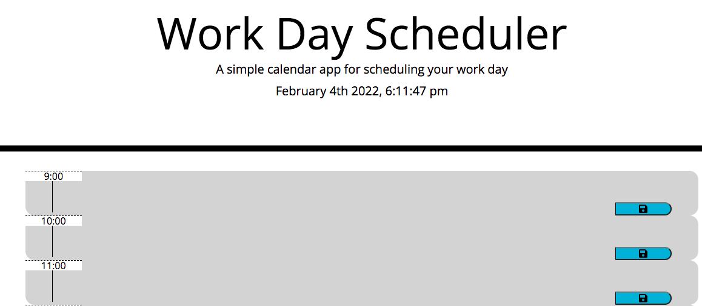

# Dayplanner

## Table of Contents

- [Picture](#picture)
- [Description](#description)
- [License](#license)
- [Installation](#installation)
- [Usage](#usage)

## Picture

## Description
This is a front-end only application of a day planner. It uses Bootstrap for styling, local storage for data persistence, Javascript for its functionality, including JQuery and the date utility library Moment.

## License
None

## Installation
The website can be viewed on a internet browser, or the repository can be forked.

## Usage
The website has no outside links or subpages. The user may type appointments into the text boxes and click the save button to save them into local storage. Past hours are colored grey, current is red, and future are green.

## Deployed Application
https://pasfrad.github.io/Dayplanner/

## For Questions
rd.hart@outlook.com